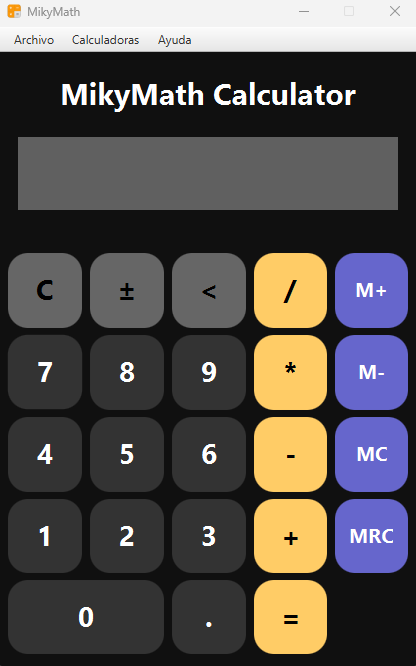
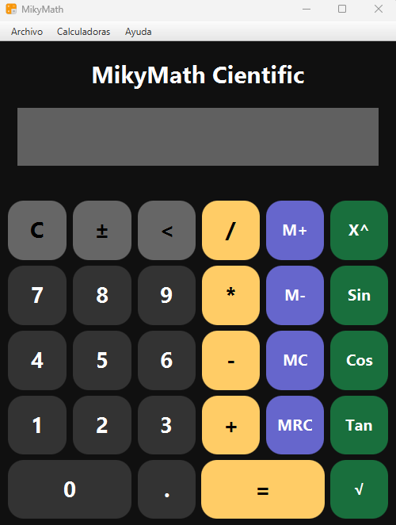
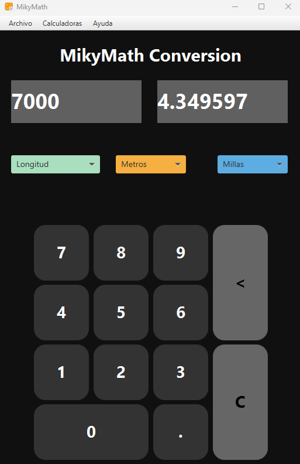
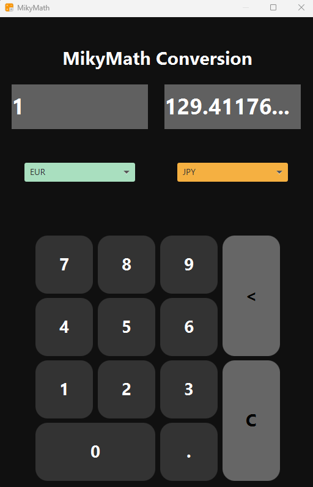

# Miguelrh22.github.io
# MikyMath Calculator

Este proyecto es una aplicación que contiene diversas calculadoras.

## Calculadora Normal

La funcionalidad de este apartado es una calculadora normal que puede realizar operaciones de los siguientes tipos:
- Suma
- Resta
- Multiplicación
- División

Los posibles errores matemáticos están controlados y los resultados redondeados a dos decimales.
También se incluye un apartado de **Memoria** para poder guardar resultados. La memoria tiene las siguientes opciones:
- Guardar
- Sumar a Memoria
- Restar a Memoria
- Reiniciar Memoria

  

## Calculadora Científica

En este apartado del proyecto se han añadido las siguientes funcionalidades:
- **Operaciones Trigonométricas**:
	- seno
	- coseno
	- tangente
- **Extras**:
	-Potencias
	-Raiz Cuadrada

  

## Calculadora Conversora

El apartado conversor permite, mediante un combobox, elegir un tipo de dato y hacer una conversión de unidades. 
Los datos incluidos en esta parte del proyecto son:
- Longitud
- Volumen
- Temperatura
- Moneda

Las unidades de longitud, volumen y temperatura permiten conversiones de distintas unidades de medida.
La conversion de moneda hace un cambio al Dolar y de ahi a las demas monedas.

  

  

